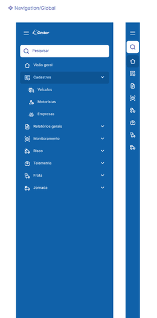

# Navigation/Global Preview

## Purpose

This preview is the approved static visual evidence for the Aurora `Navigation/Global` component contract.

## Related contract

- `components/navigation-global.json`
- `components/navigation-global.md`

## Source

- Aurora Design System
- Figma file key: `mgndALfRjfTYZtMI7ARgFd`
- Component set: `Navigation/Global`
- Component set node: `19257:2729`
- Expanded variant: `19257:2593`
- Collapsed variant: `19257:2690`

## Reference

## Interpretation rule

This image is visual evidence only. It does not replace the component contract, tokens or assets.

Do not infer undocumented interaction, responsive behavior, motion, accessibility semantics or business logic from this screenshot.
